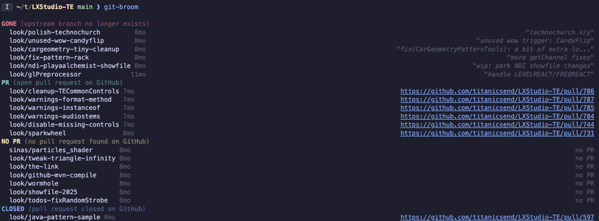
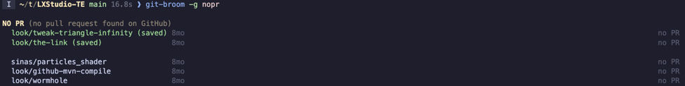
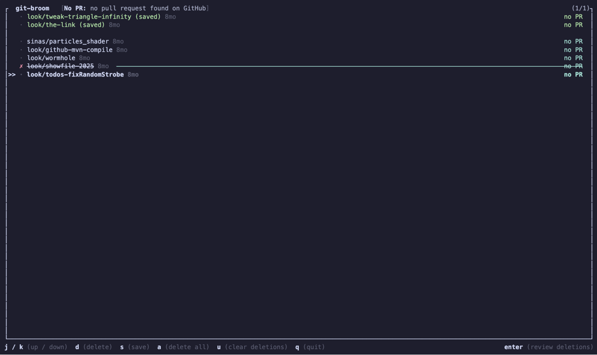
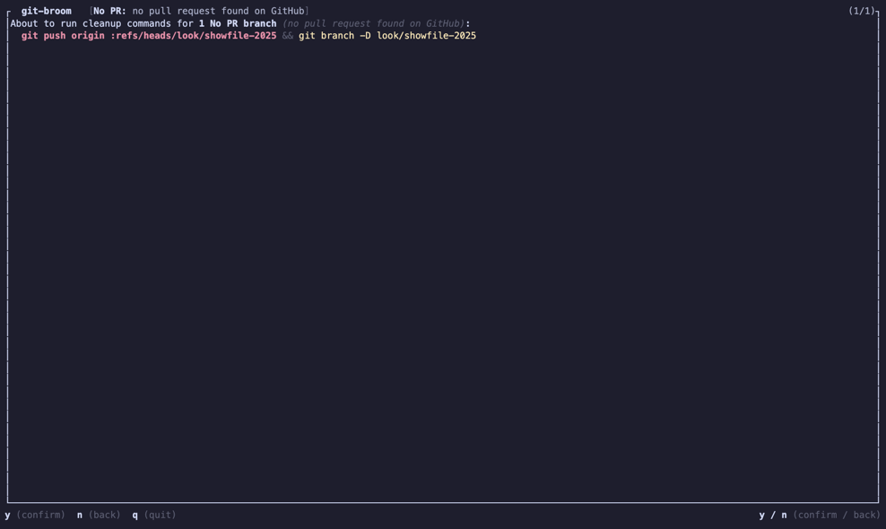

# git-broom

Squash-merge workflows leave stale tracking branches behind. You can nuke whole categories with one-liners like `git branch --merged | xargs git branch -d`, but that's often too aggressive — some branches have unpushed work, some track PRs you still care about. `git-broom` groups your branches by remote and PR status so you can see what's worth keeping at a glance, then lets you interactively triage and clean up the rest.

- **`git-broom`** — preview branches grouped by status (safe, read-only)


- **`git-broom clean`** — enter the interactive TUI to triage and delete branches


## Branch Groups

| Group | Remote | PR | Equivalent one-liner |
|-------|--------|----|----------------------|
| 🔴 `gone` | gone | — | `git branch -vv \| grep ': gone]'` |
| 🟡 `unpushed` | never | — | `git branch -vv \| grep -v '\[.*/'` |
| 🟠 `nopr` | yes | — | _(no simple one-liner)_ |
| 🔵 `closed` | yes | closed | `gh pr list --state closed --author @me` |
| 🟢 `merged` | yes | merged | `gh pr list --state merged --author @me` |
| 🔵 `pr` | yes | open | `gh pr list --author @me` |

By default, `git-broom` previews all six groups. `git-broom clean` uses all except `pr` (open PRs are preview-only).

## Install

You need [Rust](https://rustup.rs) and the [GitHub CLI](https://cli.github.com) (`gh`):

```bash
# authenticate with GitHub (needed for pr/nopr/closed/merged groups)
gh auth login

# install from crates.io
cargo install git-broom
```

## Usage

### Preview branches

```bash
# preview all groups
git-broom

# preview only specific groups
git-broom -g gone,unpushed
git-broom -g pr,closed,merged

# use a different remote (default: origin)
git-broom -g merged --remote upstream
```

### Clean up branches

```bash
# interactively triage all cleanup groups
git-broom clean

# only triage specific groups
git-broom clean -g gone,unpushed
```

## Preview mode

`git-broom` (without `clean`) prints a grouped branch list and exits — nothing is modified.



Saved branches are listed separately at the top of each group so you can see what you've previously decided to keep.



> PR metadata is cached at `.git/git-broom/pr-cache.json` (10-minute TTL) to speed up repeated previews.
> `git-broom clean` always refreshes GitHub data before entering the TUI.

## Interactive cleanup

`git-broom clean` walks each group through two TUI screens:

1. First, **triage**
2. Then **review**.

**Triage:** Browse branches in the current group and mark them for deletion or save them for later.



| Key | Action |
|-----|--------|
| `j` / `k` or `↑` / `↓` | Navigate branches |
| `d` | Toggle branch for deletion |
| `s` | Toggle save/unsave |
| `a` | Mark all deletable branches for deletion |
| `u` | Clear all delete marks |
| `Enter` | Proceed to review screen |
| `q` / `Esc` | Quit |

> Protected branches are shown for context but cannot be deleted:
> - `main`
> - `master`
> - the current branch
> - worktree checkouts

**Review:** Before anything is deleted, the review screen shows the exact git commands that will run.

- For `gone` and `unpushed` branches, this is just `git branch -D`.
- For remote-tracked groups (`nopr`, `closed`, `merged`), the remote branch is deleted first (`git push <remote> :refs/heads/<branch>`) followed by the local branch.



| Key | Action |
|-----|--------|
| `y` | Confirm and delete |
| `n` | Go back to triage |
| `q` / `Esc` | Quit |

## Saved branches

Press `s` in the triage screen to save a branch. Saved branches are:

- Excluded from `a` (mark all) and delete-all until you explicitly unsave them
- Visible in both preview and TUI output, listed at the top of their group
- Scoped to the cleanup group — saving a branch in `nopr` doesn't affect other groups


> Details:
> - Persisted per-repo at `.git/git-broom/keep-labels.json` (survives across sessions)
> - In worktree setups, saved branches resolve through the shared git common dir so all worktrees share the same saved state.

## Contributing

See [CONTRIBUTING.md](CONTRIBUTING.md) for development setup, testing, and release instructions.

## License

MIT. See [LICENSE](LICENSE).
